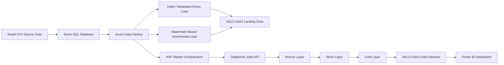

# Data Flow Diagram

```mermaid
flowchart LR
    A[Retail CSV Source Data] --> B[Azure SQL Database]
    B --> C[Azure Data Factory]
    C --> D[Initial / Metadata-Driven Load]
    C --> E[Watermark-Based Incremental Load]
    D --> F[ADLS Gen2 Landing Zone]
    E --> F
    C --> G[ADF Master Orchestration]
    G --> H[Databricks Jobs API]
    H --> I[Bronze Layer]
    I --> J[Silver Layer]
    J --> K[Gold Layer]
    K --> L[ADLS Gen2 Gold Datasets]
    L --> M[Power BI Dashboard]
```

The diagram is intentionally provided as Mermaid so it can be edited directly in GitHub.
